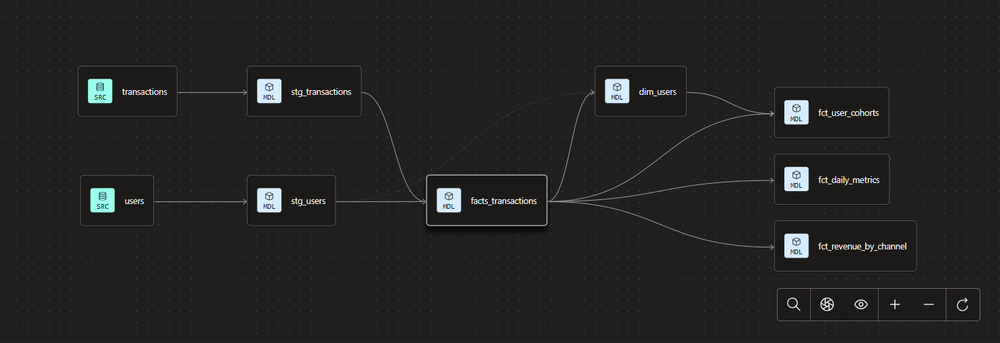

# Fintech End-End Analytics Pipeline

## Overview

This project simulates a production-grade fintech analytics platform, covering the full data lifecycle from ingestion to business intelligence.

It models user transactions, revenue generation, engagement, and loan performance to enable data-driven decision-making across growth, product, and risk functions.

Raw operational data is transformed into clean, analytics-ready datasets using dbt and surfaced through interactive dashboards for real-time business monitoring.

---

## Architecture

S3 → Airbyte → BigQuery → dbt → BI Dashboard

* **Amazon S3**: Data storage layer
* **Airbyte**: Data ingestion into the warehouse
* **BigQuery**: Central data warehouse
* **dbt**: Transformation and modeling layer
* **Metabase / Redash**: Business intelligence and visualization

---

## Data Lineage

The data pipeline follows a layered transformation approach:

- Raw source tables are standardized in staging models
- Core transactional logic is consolidated in `fact_transactions`
- Downstream models generate business-ready metrics for analytics and reporting

This structure ensures clear lineage, modularity, and maintainability across the data stack.

---

## Data Modeling Approach

The warehouse follows a layered modeling structure:

### Staging Layer

Standardizes and cleans raw data:

* `stg_transactions`
* `stg_users`
* `stg_loans`
* `stg_repayments`

---

### Core Models

#### Fact Table

* `fact_transactions`

  * Central source of transaction activity
  * Defines a consistent `primary_user_id` for user-level analysis

#### Dimension Table

* `dim_users`

  * Aggregated user-level metrics
  * Includes transaction activity, inflow/outflow, and revenue contribution

---

### Metrics Layer

* `fct_daily_metrics`

  * Daily performance metrics (GMV, revenue, active users)

* `fct_revenue_by_channel`

  * Revenue and transaction performance by acquisition channel

* `fct_user_cohorts`

  * Cohort-based retention analysis

* `fct_loan_performance`

  * Loan repayment tracking and risk metrics (repayment ratio, outstanding balance)

---

## Dashboard

The analytics layer is structured into three dashboards aligned with business stakeholders:

### Executive Overview

High-level KPIs and growth trends:

* GMV, Revenue, Active Users, ARPU, Take Rate
* Revenue and transaction trends over time

### User Growth & Engagement

Behavior and retention insights:

* Active user trends
* Cohort retention analysis
* Revenue by acquisition channel
* Geographic user distribution

### Loan Performance & Risk

Credit and risk monitoring:

* Loan volumes and repayment rates
* Default rate tracking
* Repayment behavior segmentation
* Failed transaction analysis by region

---

## Key Insights

* **Revenue vs GMV:** Revenue growth lags slightly behind GMV, suggesting pressure on monetization efficiency and potential pricing optimization opportunities

* **Stable User Activity:** Active users remain relatively stable over time, indicating consistent engagement but limited user growth acceleration

* **Revenue Concentration:** Certain acquisition channels generate disproportionately higher revenue, highlighting dependence on key growth channels

* **User Distribution:** A small number of countries contribute a large share of total users, indicating geographic concentration of adoption

* **Loan Risk Exposure:** Approximately 11% of loans fall into default, with a significant portion categorized as late or very late repayments

* **Repayment Behavior:** A large share of loans are either early or significantly delayed, suggesting uneven repayment patterns and risk segmentation opportunities

---

## Business Recommendation

* **Improve Monetization Strategy:** Optimize pricing or fee structures to increase take rate without impacting transaction volume

* **Enhance User Retention:** Address early-stage drop-offs through onboarding improvements and targeted engagement strategies

* **Diversify Acquisition Channels:** Reduce dependency on top-performing channels by investing in underutilized sources

* **Expand Geographical Reach:** Focus growth efforts on underrepresented regions to balance user distribution

* **Strengthen Risk Controls:** Introduce stricter credit scoring or monitoring for high-risk loan segments

* **Target Repayment Behavior:** Develop interventions (reminders, incentives) for late and very late repayment groups

---

## Data Quality & Reliability

* Implemented dbt tests (`not_null`, `unique`, `accepted_values`) to enforce data integrity
* Applied defensive transformations using `safe_cast` and `safe_divide`
* Maintained consistent model grain and metric definitions

---

## Historical Tracking

* Implemented dbt snapshots to track changes in user attributes over time
* Enables longitudinal analysis of user behavior and lifecycle changes

---

## Capabilities

This platform supports:

* Revenue and growth analysis
* User segmentation and engagement tracking
* Retention and cohort analysis
* Lending performance and risk monitoring

---

## Future Enhancements

* Incremental modeling for large-scale data processing
* Real-time data ingestion
* Advanced fraud detection models
* Customer lifetime value (LTV) modeling

---
